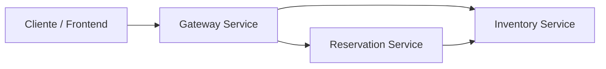

# Aplicacao de Aluguel de Carros Cloud-Native

Este repositório deixou de ser apenas um resumo conceitual e virou um MVP executável de arquitetura cloud-native para aluguel de carros. A solução foi montada como um monorepo com três microsserviços, comunicação HTTP entre serviços, empacotamento com Docker, exemplo de deploy em Kubernetes e pipeline de CI com GitHub Actions.

## O que o projeto entrega

- `inventory-service`: catálogo de carros e controle de disponibilidade
- `reservation-service`: criação e cancelamento de reservas
- `gateway-service`: ponto de entrada para consumo da plataforma
- `docker-compose.yml`: ambiente local para subir tudo com um comando
- `infra/k8s`: manifests para demonstrar deploy em Kubernetes
- `.github/workflows/ci.yml`: pipeline para rodar testes automaticamente

## Arquitetura



## Stack

- Python 3.11
- FastAPI
- SQLite para persistência local de demonstração
- Docker e Docker Compose
- Kubernetes manifests
- GitHub Actions

## Como executar localmente

### Opcao 1: com Docker Compose

```bash
docker compose up --build
```

Serviços disponíveis:

- Gateway: `http://localhost:8000`
- Inventory: `http://localhost:8001/docs`
- Reservations: `http://localhost:8002/docs`

### Opcao 2: sem Docker

```bash
pip install -r requirements.txt
uvicorn services.inventory_service.app:app --reload --port 8001
uvicorn services.reservation_service.app:app --reload --port 8002
uvicorn services.gateway_service.app:app --reload --port 8000
```

## Endpoints principais

### Gateway

- `GET /catalog`
- `POST /reservations`
- `GET /reservations`
- `POST /reservations/{reservation_id}/cancel`
- `GET /dashboard`

### Inventory

- `GET /cars`
- `GET /cars/{car_id}`
- `POST /internal/cars/{car_id}/hold`
- `POST /internal/cars/{car_id}/release`

### Reservations

- `GET /reservations`
- `POST /reservations`
- `POST /reservations/{reservation_id}/cancel`

## Exemplo de reserva

```json
POST /reservations
{
  "customer_name": "Maria Souza",
  "customer_document": "12345678900",
  "car_id": "car-001",
  "pickup_city": "Sao Paulo",
  "start_date": "2030-05-10",
  "end_date": "2030-05-13"
}
```

## Kubernetes

Os manifests em `infra/k8s` mostram uma versão inicial de deploy com:

- namespace dedicado
- deployments para os 3 serviços
- services internos para comunicação
- `LoadBalancer` no gateway
- probes de readiness e liveness

Aplicação:

```bash
kubectl apply -f infra/k8s/namespace.yaml
kubectl apply -f infra/k8s/inventory.yaml
kubectl apply -f infra/k8s/reservations.yaml
kubectl apply -f infra/k8s/gateway.yaml
```

## Testes

```bash
pytest
```

Os testes cobrem a lógica principal de inventário e reservas, incluindo bloqueio e devolução de unidades.

## Diferenciais para portfólio

- arquitetura distribuída simples, mas funcional
- separação clara de responsabilidades
- health checks
- persistência local por serviço
- pipeline de CI
- base pronta para evoluir para banco gerenciado, mensageria e autenticação

## Proximos passos recomendados

- trocar SQLite por PostgreSQL
- adicionar autenticação JWT no gateway
- publicar imagens em registry
- incluir observabilidade com Prometheus e Grafana
- evoluir o fluxo de reserva para eventos assíncronos
